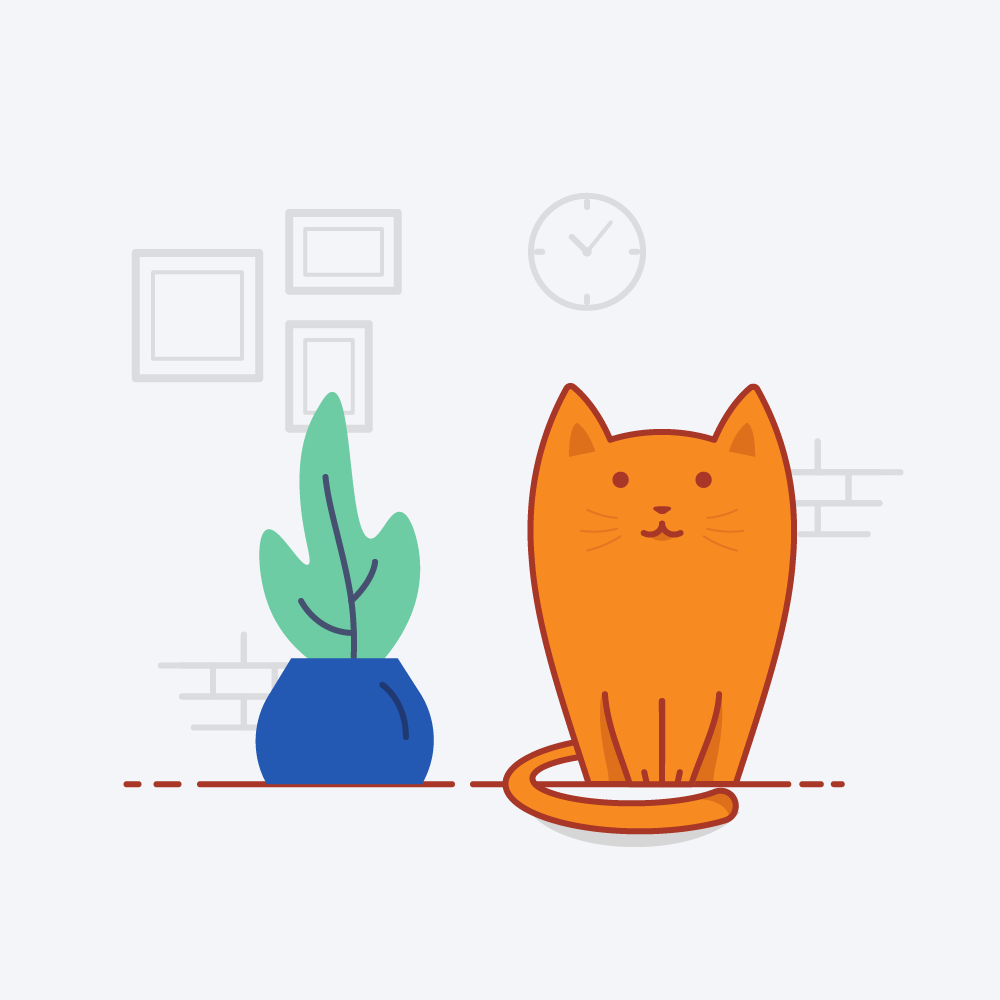

<div align="center" >

# ✨ Lorena Fudel - Práctica GitHub con HTML y CSS ✨

Aprendiendo, creando y compartiendo 🚀  

[](https://lorena-fudel.github.io/lorena-fudel-practicaGitHubCss/)  
  
  


</div>

<div align="center">
  
</div>


---

# 🌐 Proyecto: Práctica GitHub con HTML y CSS

Este es un proyecto personal creado como práctica para aprender a usar **GitHub Pages** y aplicar conocimientos de **HTML y CSS**.  
La página incluye secciones sobre inquietudes, objetivos y filosofía de vida, mostrando un diseño sencillo y limpio.

🔗 **Demo en vivo**: [Ver proyecto](https://lorena-fudel.github.io/lorena-fudel-practicaGitHubCss/)

---

## 📂 Estructura del proyecto

- `index.html` → Página principal con el contenido.
- `style.css` → Archivo de estilos en CSS.
- `img/` → Carpeta de imágenes utilizadas en la página.

---

## 🚀 Cómo usarlo

1. Clona este repositorio:
   ```bash
   git clone https://github.com/lorena-fudel/lorena-fudel-practicaGitHubCss.git


🤝 Contribuciones

Este es un proyecto de práctica, pero cualquier sugerencia o mejora será bienvenida.
Puedes hacer un fork del repositorio y enviar un pull request.

📄 Licencia

Este proyecto está bajo la licencia MIT.
Eres libre de usarlo, modificarlo y compartirlo.
